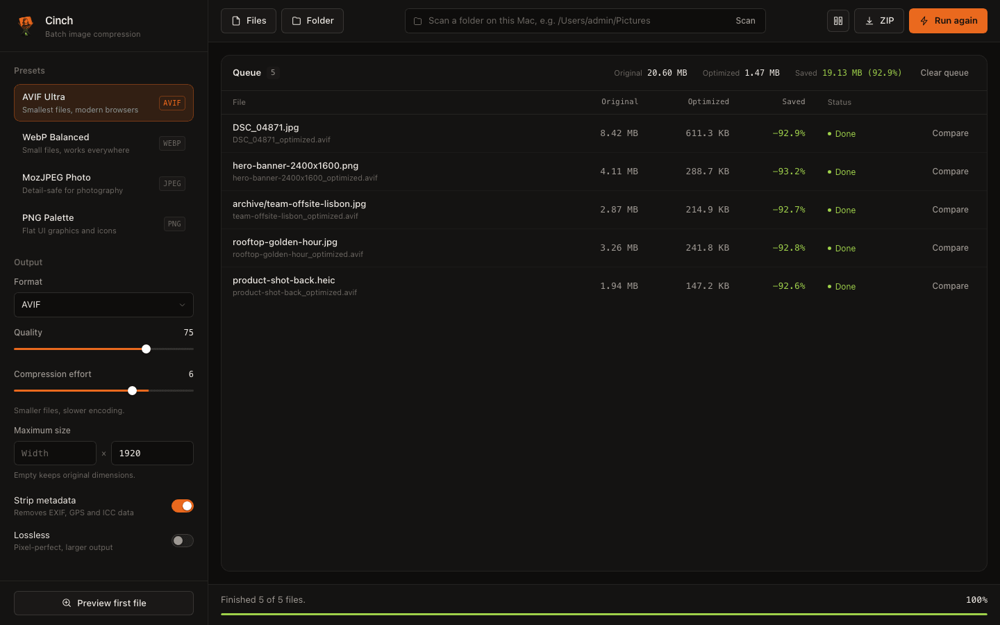
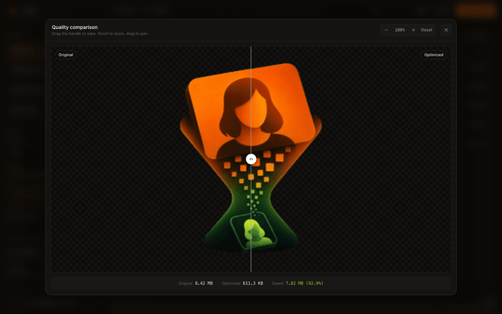

<div align="center">


# Cinch

**Drop in a folder of photos. Get them back up to 90% smaller — without seeing the difference.**




</div>

---

## What is this?

A photo straight from a phone or camera is typically 3–10 MB. Most of that weight is detail your
eye will never notice — and it is what makes a web page crawl and a disk fill up.

Cinch re-encodes those files with a modern codec and hands them back at a fraction of the size.
A typical photo comes out **85–95% smaller** with no visible change. Point it at a folder, press
one button, and the originals are left untouched.

It runs entirely on your own machine. Nothing is uploaded anywhere.

> **Real example.** The logo above, run through Cinch at the default settings:
> `172 KB → 14.9 KB` — 91.4% smaller, in 123 ms.

---

## Quick start

You need [Node.js](https://nodejs.org) 18.17 or newer.

```bash
git clone https://github.com/novolg/Cinch.git
cd Cinch
npm install
npm start
```

Your browser opens at `http://localhost:3777`. On macOS you can also just double-click
**`launch.command`** in Finder — no terminal needed.

Then:

1. Drag photos or a whole folder onto the window (or paste a path like `/Users/you/Pictures` and press Enter).
2. Pick a preset, or set quality by hand.
3. Press **Optimize**.
4. Grab the results from the output folder, or download them as a ZIP.

---

## Presets

Not sure what to pick? Start at the top.

| Preset | Format | Best for |
| --- | --- | --- |
| **AVIF Ultra** | AVIF | The smallest possible files. Supported by every current browser. |
| **WebP Balanced** | WebP | Nearly as small, and readable by anything from the last decade. |
| **MozJPEG Photo** | JPEG | Photography where you want a plain `.jpg` at the end. |
| **PNG Palette** | PNG | Flat graphics, icons and screenshots with few colours. |

Everything is adjustable: quality, compression effort, maximum dimensions, whether to keep EXIF
and GPS metadata, and a lossless mode for when the pixels must match exactly.

---

## Check before you commit

Compression is a judgement call, so Cinch never asks you to take it on faith. **Preview** any file
to get a wipe slider between the original and the result — zoom in to 8×, pan around, and decide
for yourself whether the setting holds up.

<div align="center">

</div>

---

## Command line

The same engine, without the browser:

```bash
# Convert a folder to AVIF
./cli.js ./my_photos -f avif -q 65 -o ./optimized

# WebP, resized down to Full HD
./cli.js ./my_photos -f webp -q 80 -w 1920

# Keep the original format, just squeeze it
./cli.js ./my_photos -f original -q 85
```

After `npm link` the command is available anywhere as `cinch`.

| Flag | Meaning | Default |
| --- | --- | --- |
| `-o, --output <dir>` | Where results are written | `./optimized_output` |
| `-f, --format <type>` | `avif`, `webp`, `jpeg`, `png`, `original` | `webp` |
| `-q, --quality <n>` | Quality, 1–100 | `80` |
| `-e, --effort <n>` | Compression effort, 0–9 — higher is smaller and slower | `6` |
| `-w, --max-width <px>` | Width limit, aspect ratio preserved | — |
| `-h, --max-height <px>` | Height limit, aspect ratio preserved | — |
| `--keep-exif` | Keep EXIF/ICC metadata instead of stripping it | off |
| `--lossless` | Lossless mode | off |
| `-r, --recursive` | Walk subdirectories | on |

---

## Under the hood

Cinch is a thin layer over [sharp](https://sharp.pixelplumbing.com) and **libvips**, which do the
actual encoding in native code — that is why a few hundred photos take seconds rather than minutes.
Progress streams to the interface over a WebSocket, so a long batch stays honest about where it is,
and can be paused or stopped mid-run.

```
server.js      Express + WebSocket server
optimizer.js   The encoding core (sharp / libvips)
cli.js         Terminal interface
public/        Web interface — HTML, CSS, JS, no build step
icon.png       Source logo; the web assets are generated from it
```

There is no bundler, no framework and no tracking. `public/` is three files you can read in one sitting.

---

## License

ISC — see [LICENSE](LICENSE).
